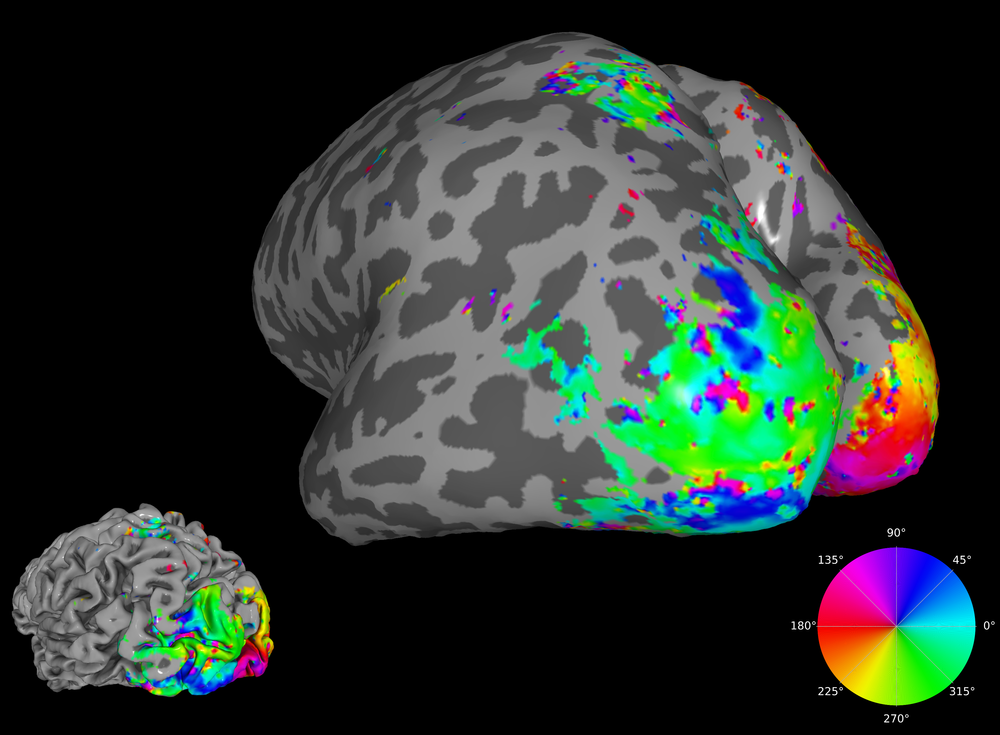

# Soglio workshop on computational techniques for Neuroeconomics



Welcome on the repository for the workshop ***Making Your Models Fly: Computational Tools for Neuroeconomic Modeling*** which was presented by Gilles de Hollander on the 18th of September in Soglio, Switzerland.
It consisted of a couple of presented 'vignettes' on CPUs vs GPUs, computational graphs, encoding models for fMRI, the Bayesian encoding/decoding framework, and how to efficiently implement efficient coding models for fitting/simulation.

There are also a couple of exercises. To some extent, the answers to those exercises can be found in the `answers`-branch.

## Slides:

Slides were written using MARP and can be found in the [`slides`](slides)-directory, there are the following 4 vignettes:


1. [Computational Graphs](https://www.gillesdehollander.nl/computation-in-neuroeconomics-workshop2025/slides/1_computational_graphs.html) ([PDF](slides/1_computational_graphs.pdf) / [Markdown](slides/1_computational_graphs.md))
2. [Encoding Models for fMRI](https://www.gillesdehollander.nl/computation-in-neuroeconomics-workshop2025/slides/2_encoding_models.html) ([PDF](slides/2_encoding_models.pdf) / [Markdown](slides/2_encoding_models.md))
3. [From Encoding to Decoding](https://www.gillesdehollander.nl/computation-in-neuroeconomics-workshop2025/slides/3_from_encoding_to_decoding.html) ([PDF](slides/3_from_encoding_to_decoding.pdf) / [Markdown](slides/3_from_encoding_to_decoding.md))
4. [Efficient Coding](https://www.gillesdehollander.nl/computation-in-neuroeconomics-workshop2025/slides/4_efficient_coding.html) ([PDF](slides/4_efficient_coding.pdf) / [Markdown](slides/4_efficient_coding.md))


## Exercises
The exercises can be found in the (`exercises`)(exercises)-folder:

 1. The Graphs Underlying Computational graphs ([notebook](notebooks/1_computational_graphs.ipynb))
 2. Fast and slow implementations of the drift diffusion model ([notebook](notebooks/2_ddm_fast_and_slow.ipynb))
 3. Implementing a PRF model using Tensorflow (or Pytorch or Jax) ([notebook](notebooks/3_implement_prf.ipynb))
 4. Decoding a visual stimulus ([notebook](notebooks/4_decode.ipynb))
 5. Efficient coding, efficiently coded ([notebook](notebooks/5_efficient_coding.ipynb))

## Further reading
- [Braincoder tutorials](https://braincoder-devs.github.io/)  
- [TensorFlow guide](https://www.tensorflow.org/guide)  


# Cloning this repository

To clone this repository locally or remotely, use the following commands in your terminal:

```bash
# Recommended location
cd $HOME/git

# Clone via HTTPS
git clone https://github.com/Gilles86/computation-in-neuroeconomics-workshop2025.git

# Or clone via SSH (if you have SSH keys set up)
git clone git@github.com:Gilles86/computation-in-neuroeconomics-workshop2025.git
```

This guide assumes you place the repository in `$HOME/git/computation-in-neuroeconomics-workshop2025`.

# Install environment

## Why install the Conda environments?

This workshop provides three Conda environment files to ensure everyone can run the code smoothly, regardless of setup:

- **`environment.yml`** — Standard environment for most users (Windows, Linux, Intel-based Macs).  
- **`environment_metal.yml`** — Optimized for Apple Silicon (M1/M2/M3), using Metal for GPU acceleration.  
- **`environment_gpu.yml`** — For use on the UZH ScienceCluster (with CUDA + GPUs).

---

## Installation on your own machine

1. **Install Conda or Mamba**  
   - Download [Mambaforge](https://github.com/conda-forge/miniforge#mambaforge) (recommended) or [Miniconda](https://docs.conda.io/en/latest/miniconda.html).  

2. **Navigate to the `environments` folder**:
   ```bash
   cd environments
   ```

3. **Create the environment**:
   - For **Windows, Linux, Intel Macs**:
     ```bash
     conda env create -f environment.yml
     ```
   - For **Apple Silicon Macs**:
     ```bash
     conda env create -f environment_metal.yml
     ```

4. **Activate the environment**:
   ```bash
   conda activate neuroeconomics_2025
   ```
   *(Replace `neuroeconomics_2025` with the actual name from the `.yml` file if different.)*

5. **Optional: verify GPU support**:
   ```bash
   python check_for_gpu.py
   ```

---

## Installation on the UZH ScienceCluster

On the ScienceCluster, you **must not install environments in `$HOME`** (limited quota).  
Always use `/data/$USER` for Conda/Mamba and environments.  
See also the official docs: [How to use Conda on the ScienceCluster](https://docs.s3it.uzh.ch/how-to_articles/how_to_use_conda/).

### Step 1: Load Mamba (recommended)
```bash
module load mamba
```

Configure Conda to always place envs/packages in `/data/$USER` by creating `~/.condarc`:
```yaml
envs_dirs:
  - /data/$USER/conda/envs
pkgs_dirs:
  - /data/$USER/conda/pkgs
```

*(Alternatively, you can install your own Mambaforge under `/data/$USER/mambaforge`, but `module load mamba` is preferred.)*

### Step 2: Open a GPU node
TensorFlow must be installed on a GPU node so it links correctly to CUDA libraries:
```bash
srun --gres=gpu:1 --time=60:00 --mem=32G --cpus-per-task=8 --pty bash
```

Then load mamba:
```bash
module load mamba
```

### Step 3: Load CUDA drivers
```bash
module load gpu
```

### Step 4: Create the GPU environment
Navigate to the repo’s `environments` folder and create the environment:
```bash
cd /$HOME/git/computation-in-neuroeconomics-workshop2025/environments # replace with whatever you use
mamba env create -f environment_gpu.yml
```

### Step 5: Activate new gpu environment
```bash
conda activate soglio_gpu
```

### Step 6: Check for GPU
You can use the script `check_for_gpu.py` to check whether Tensorflow can find you GPU:

```bash
python check_for_gpu.py
```

Which should output something like
```bash
2025-09-12 12:19:11.012999: I tensorflow/core/util/port.cc:113] oneDNN custom operations are on. You may see slightly different numerical results due to floating-point round-off errors from different computation orders. To turn them off, set the environment variable `TF_ENABLE_ONEDNN_OPTS=0`.
2025-09-12 12:19:11.047671: E external/local_xla/xla/stream_executor/cuda/cuda_dnn.cc:10575] Unable to register cuDNN factory: Attempting to register factory for plugin cuDNN when one has already been registered
2025-09-12 12:19:11.047719: E external/local_xla/xla/stream_executor/cuda/cuda_fft.cc:479] Unable to register cuFFT factory: Attempting to register factory for plugin cuFFT when one has already been registered
2025-09-12 12:19:11.049371: E external/local_xla/xla/stream_executor/cuda/cuda_blas.cc:1442] Unable to register cuBLAS factory: Attempting to register factory for plugin cuBLAS when one has already been registered
2025-09-12 12:19:11.055219: I tensorflow/core/platform/cpu_feature_guard.cc:210] This TensorFlow binary is optimized to use available CPU instructions in performance-critical operations.
To enable the following instructions: SSE4.1 SSE4.2 AVX AVX2 AVX512F AVX512_VNNI FMA, in other operations, rebuild TensorFlow with the appropriate compiler flags.
TensorFlow version: 2.16.2
NumPy version: 1.26.4
GPU devices: [PhysicalDevice(name='/physical_device:GPU:0', device_type='GPU')]
2025-09-12 12:19:14.321458: I tensorflow/core/common_runtime/gpu/gpu_device.cc:1928] Created device /job:localhost/replica:0/task:0/device:GPU:0 with 31134 MB memory:  -> device: 0, name: Tesla V100-SXM2-32GB, pci bus id: 0000:89:00.0, compute capability: 7.0
DDM test successful: (1000, 100)
```

(Don't worry about the warnings about oneDNN, cuDNN, etc. This is fine. The point is that it finds `GPU devices: [PhysicalDevice(name='/physical_device:GPU:0', device_type='GPU')]`)

