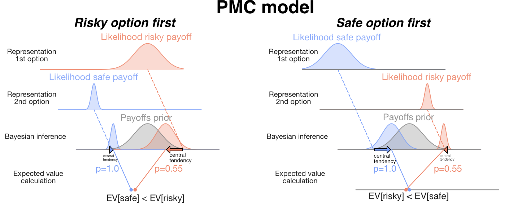
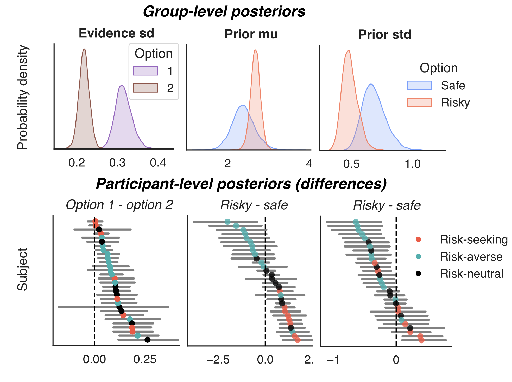
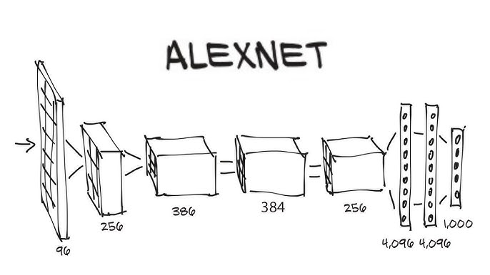
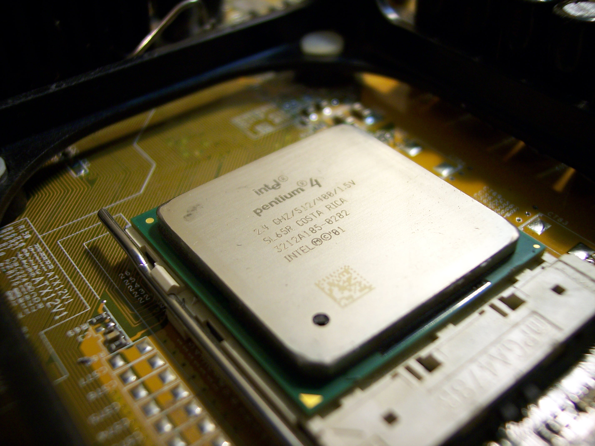
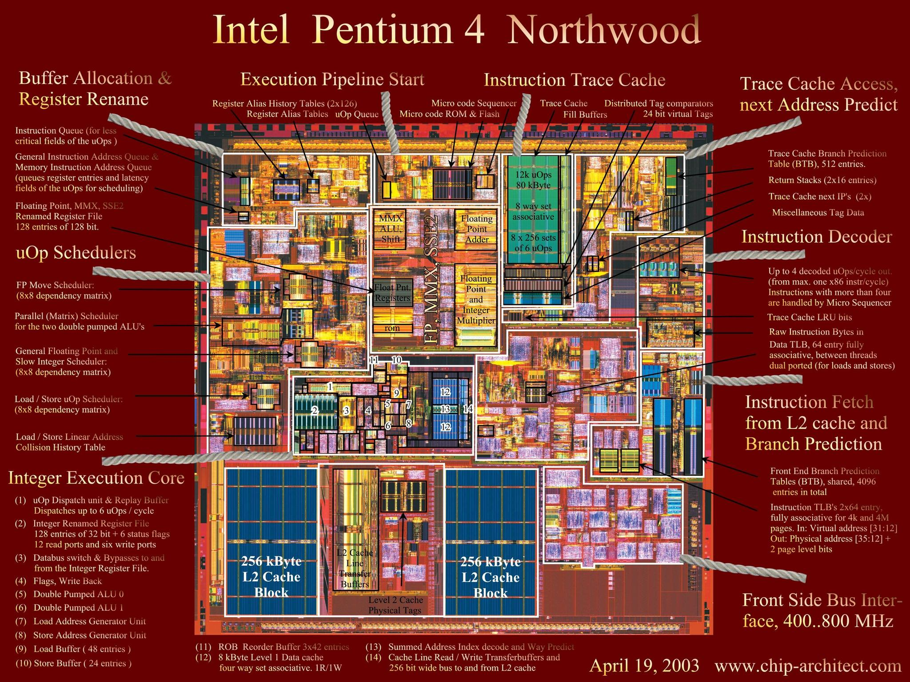
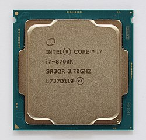
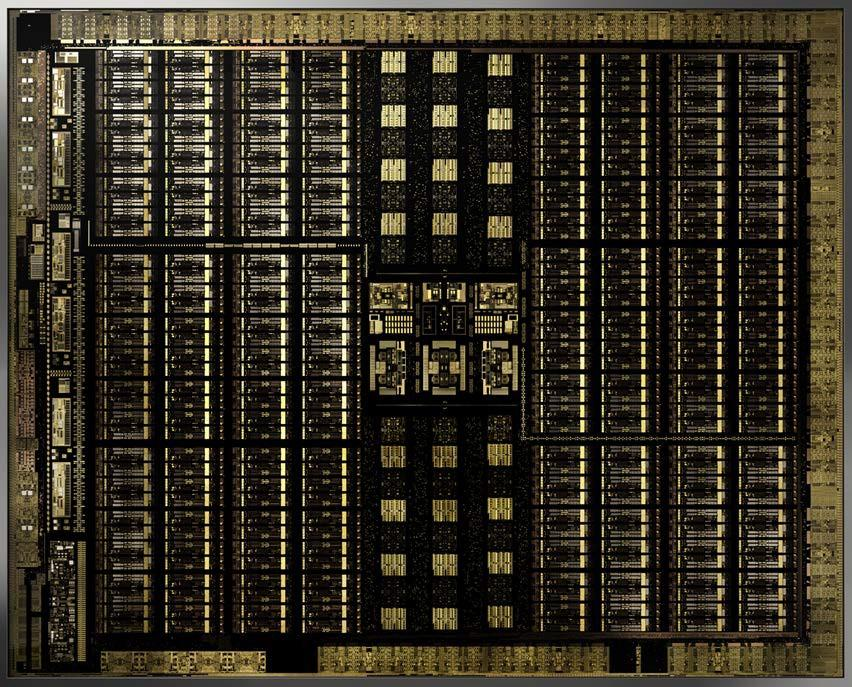
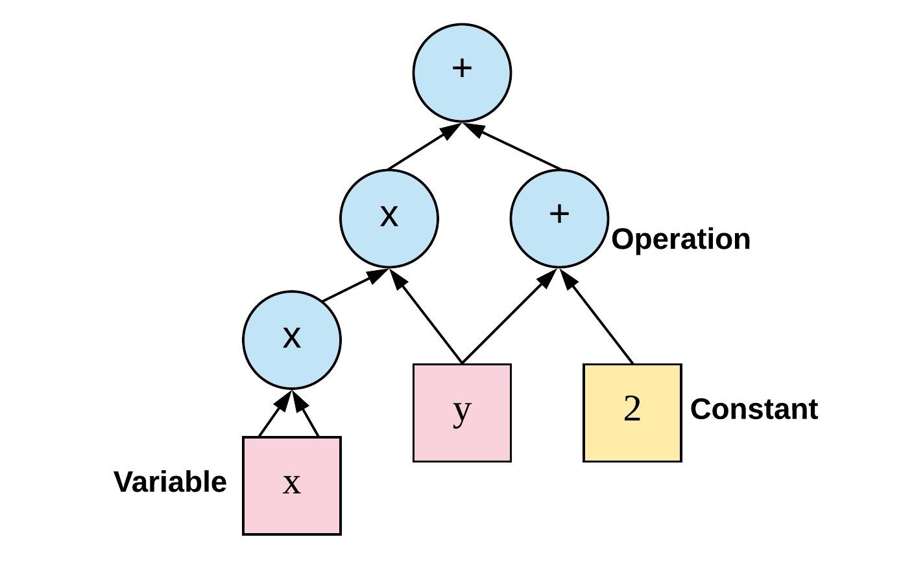
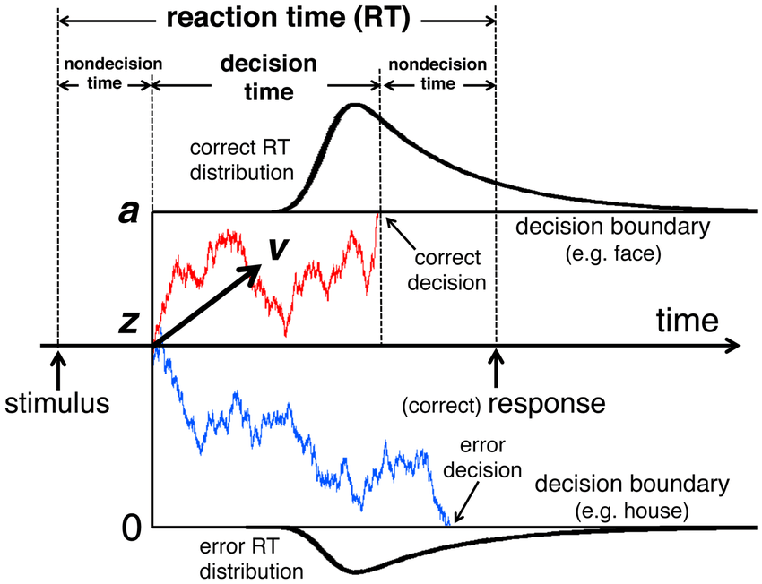

# Making Your Models Fly
### Computational Tools for Neuroeconomic Modeling
```python
import numpy as np, jax.numpy as jnp
x = np.linspace(-1, 1, 1000000)
y = jnp.sin(x) + x**2
```
Gilles de Hollander

---
# Today
- Why bother?
- A bit of computer science
- Computational graphs
- Optimizing code
- Example 1: Encoding models (e.g., PRF models)
- Example 2: Efficient coding models

---
## Why bother?
<div class="two-col two-col--50">
  <div class="col vcenter">

#### Neuroeconomics is full of complex models
  - **Cognitive models**
  - Neural models

  </div>
  <div class="col">


**Bayesian perceptual model of risky choice**
*de Hollander et al. (2025)*

  </div>
</div>

---
## Why bother?
<div class="two-col two-col--50">
  <div class="col vcenter">

#### Neuroeconomics is full of complex models
  - Cognitive models
  - **Neural models**

  </div>
  <div class="col">


**Polar angle map of retinotopic organization**
*de Hollander et al. (in prep)*

  </div>
</div>

---
## Why bother?
<div class="two-col two-col--50">
  <div class="col vcenter">

#### Bayesian estimation versus point estimates

  </div>
  <div class="col">


**Posterior estimates at group- and participant-level**
*de Hollander et al., (2025)*

  </div>
</div>


---
## Why bother?
<div class="two-col two-col--30-70">
  <div class="col vcenter">

#### Job market

  </div>

   <div class="col">


<div class="two-col">
<div class="col">


</div>
<div class="col">


 </div>
</div>

---
## The Deep learning Revolution

<div class="two-col">
  <div class="col">

#### Chat bots


 </div>

<div class="col">

#### Generative AI


 </div>

<div>

</div>

---
## The Deep learning Revolution

<div class="two-col">
 <div class="col">

 - Started with *Alexnet* (2012)

 - Key innovations
   - **Very large data** set (1.2 million images)
   - Training on **GPU**
   - Use of **autodiff**

 </div>

 <div class="col vcenter">



 </div>
 </div>

---
### A little bit of Computer Science

<!--  -->


<div class="two-col" style="text-align: center; margin: 20px 0;">
<div class="col center vcenter">

   

</div>
</div>


---
<style scoped>
  section li {
    font-size: 24pt;
  }
  .col code, .col pre {
    font-size: 12pt;
  }
  .col p {
    font-size: 24;
  }
</style>
### A little bit of Computer Science
<div class="two-col two-col--50">
  <div class="col vcenter" >

- Processing units **cannot** "read" programming languages!
- They only execute **machine code** (binary instructions).
- Machine code depends on *platform/instruction set*
  - x86 (Your dad's PC)
  - ARM (New Macs/iPhones)
  - GPU (NVidia, deep learning)
</div>
  <div class="col vcenter">

**Example: x86 Machine Code (Assembly)**

  ```asm
  ; Simple function: add two numbers
  section .text
    global _start
  _start:
    mov eax, 5      ; Load 5 into register EAX
    add eax, 3      ; Add 3 to EAX (result = 8)
    ret             ; Return from function
  ```

   **Binary representation:**
   ```
    `10110000 00000101` (mov eax, 5)
    `00000000 00000011` (add eax, 3)
    `11000011`         (ret)
  ```

---

### x86 Architecture
<div class="two-col">
<div class="col text-medium">

**History:**
- 1978: Intel 8086
- 1985: 32-bit (80386)
- 2003: 64-bit (AMD64)

**Strengths:**
- Single-core performance
- Legacy compatibility
- Desktop/server dominance


</div>
<div class="col vcenter">




</div>
</div>

---

### ARM Architecture
<div class="two-col">
<div class="col text-medium">

**History:**
- 1985: Acorn RISC
- 2007: iPhone
- 2020: Apple M1

**Strengths:**
- Energy efficiency
- Parallel processing
- System-on-a-chip


</div>
<div class="col vcenter">


</div>
</div>

---

### GPU Architecture
<div class="two-col">
<div class="col text-medium">

**History:**
- 1999: GeForce 256
- 2006: CUDA
- 2012: Deep learning

**Strengths:**
- Massive parallelism
- Tensor operations
- AI acceleration

</div>
<div class="col vcenter">



</div>
</div>

---
### A little bit of Computer Science

* Your code (Python/Matlab/C++) needs to be '*translated* to *platform-specific* byte-code.

Two main possibilities:
 1. *Compiled languages* (C++, Rust)
 2. *Interpreted languages* (Matlab/Python/R)
 

---
### A little bit of Computer Science

<div class="text-medium">

Most of use use *hybrid* approaches, where the compiled executables of *Matlab*, *R*, *Python (numpy)*  are linked to very fast functions compiled in C (e.g, matrix multiplication).

**How It Works**:
1. You write **high-level code** (Python/MATLAB/R).
2. Heavy computations **delegate to compiled libraries** (C/Fortran).
3. *Example*:

```python
# Python (interpreted)
result = np.dot(A, B)  # Calls BLAS (compiled C/Fortran)
```

</div>

---
### The Future: Computational Graph Libraries

<div class="two-col two-col">


<div class="col text-small">

**1. Key Idea**
Represent your computational problem as a *graph*.

**2. Key features**
- **Declarative programming**: Define *what* to compute, not *how*.
- **Automatic differentiation (autodiff)**: Gradients computed symbolically.
- **Optimizations**: Graph-level fusion, parallelism, and hardware targeting.

</div>

<div class="col vcenter">



</div>
</div>

---
### Exercise 1: DDM simulation in Tensorflow

#### First things first
 * Visual Studio Code
 * Conda environments:
```
conda env list
 * soglio
(* soglio_metal)
(* soglio_gpu)
```

---
### Exercise 1: DDM simulation in Tensorflow

<div class="two-col">
<div class="col vcenter">

How would you guys implement this?

</div>
<div class="col">



</div>
</div>


---
### DDM simulation in Tensorflow
``` python
@tf.function
def ddm_tensorflow(n_trials=1000, max_t=10.0, dt=0.001, drift=0.1, noise=0.1, bound=1.0):
    n_steps = int(max_t / dt)

      # Generate all noise terms at once
      noise_terms = noise * tf.sqrt(dt) * tf.random.normal([n_trials, n_steps])

      # Create evidence trajectory (n_trials × n_steps)
      drift_terms = tf.ones([n_trials, n_steps]) * drift * dt
      evidence = tf.cumsum(drift_terms + noise_terms, axis=1)

      # Add initial zeros
      evidence = tf.pad(evidence, [[0, 0], [1, 0]], constant_values=0.0)

      # Find crossing times
      crossed_up = evidence >= bound
      crossed_down = evidence <= -bound
      crossed = crossed_up | crossed_down

      # Get first crossing time
      rts = tf.where(
          tf.reduce_any(crossed, axis=1),
          dt * tf.cast(tf.argmax(tf.cast(crossed, tf.int32), axis=1), tf.float32),
          tf.constant(max_t, dtype=tf.float32)
)

      # Determine responses
      responses = tf.where(tf.reduce_any(crossed_up, axis=1),
                          1,
                          tf.where(tf.reduce_any(crossed_down, axis=1),
                                  0,
                                  tf.random.uniform([n_trials], 0, 2, tf.int32)))

      return responses, rts
```