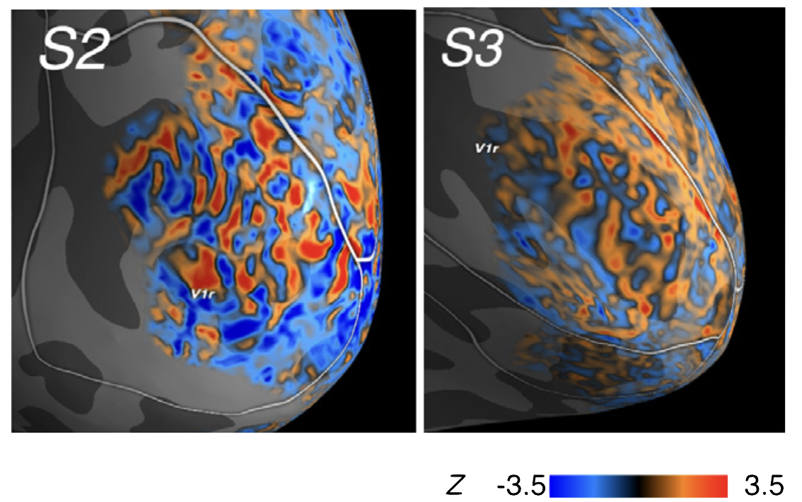
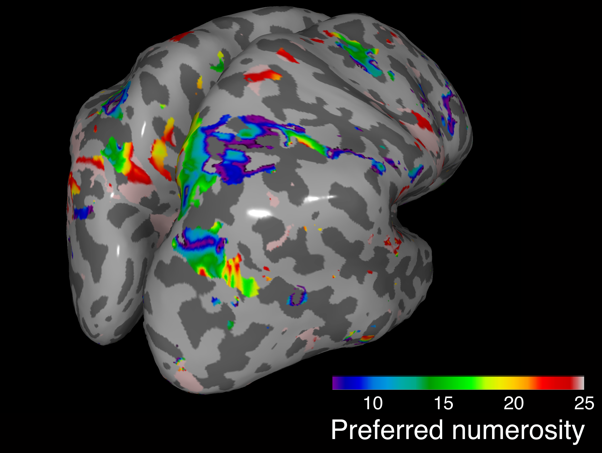
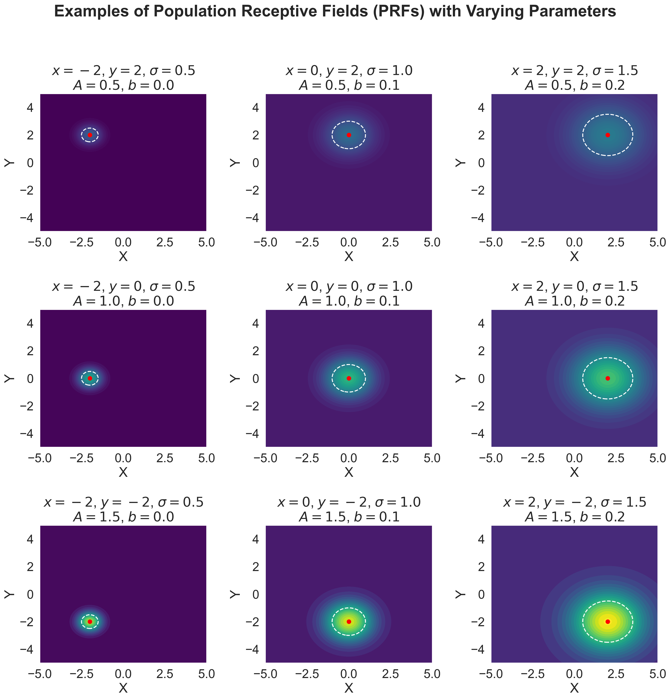
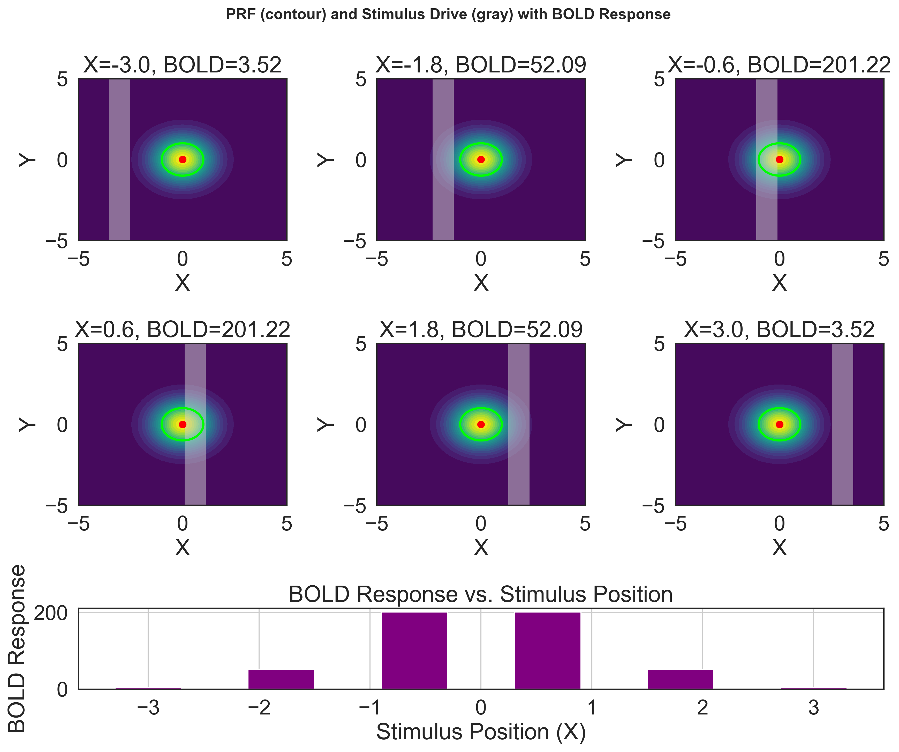
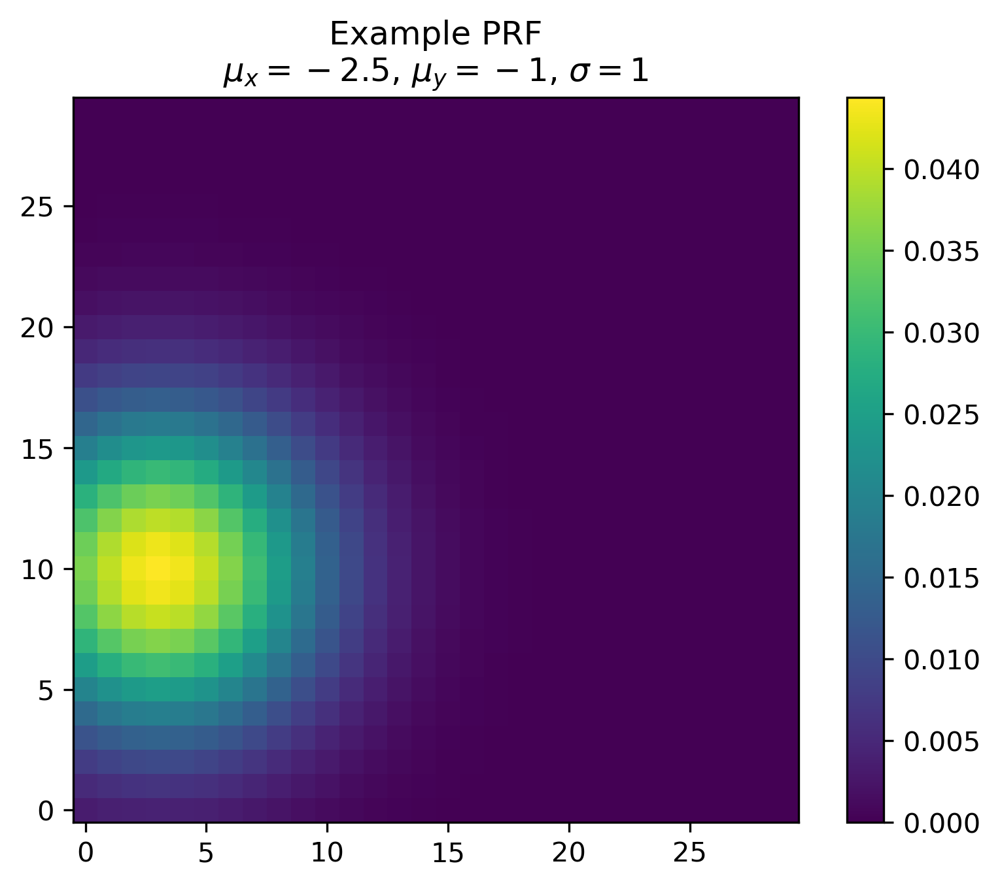
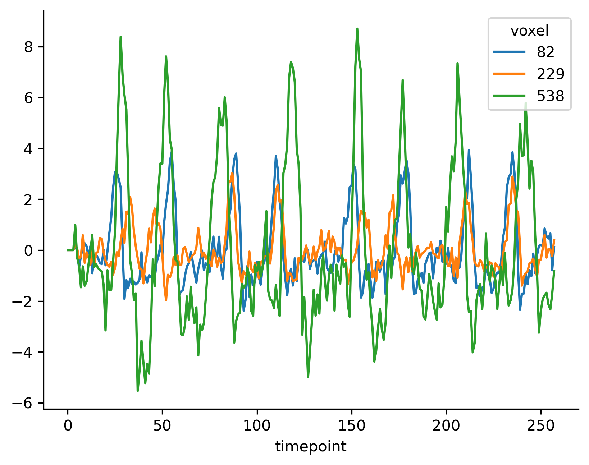
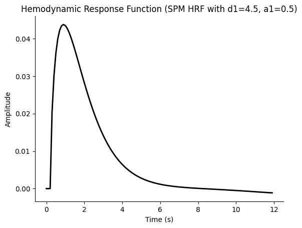

## Encoding models for fMRI

<div class="fit-width vcenter center">

  

</div>


----
## Topographic organisation of neural representation

<div class="two-col">

<div class="col">

**Cortical organization** mirrors the **structure of stimulus spaces**, with adjacent neural populations encoding similar stimuli—be it spatial location, numerical proximity, or feature similarity.

</div>

<div class="col center vcenter">

  

  de Hollander et al. (*in prep*)

</div>

</div>

----
## Topographic organisation of neural representation

<div class="two-col">

<div class="col">

**Cortical organization** mirrors the **structure of stimulus spaces**, with adjacent neural populations encoding similar stimuli—be it spatial location, numerical proximity, or feature similarity.

</div>

<div class="col center vcenter">

  

  de Hollander et al. (2021)


</div>

</div>


----
## Topographic organisation of neural representation

<div class="two-col">

<div class="col">

**Cortical organization** mirrors the **structure of stimulus spaces**, with adjacent neural populations encoding similar stimuli—be it spatial location, numerical proximity, or feature similarity.

</div>

<div class="col center vcenter">

  

  de Hollander et al. (in prep.)


</div>

</div>


---
## Encoding models

 - Encoding models allow us to map *features of the outside world* to *brain activation patterns*

   - Visuospatial location
   - Gabor orientations
   - Auditory frequency
   - Numerosity
   - Value
 - A "standard GLM" can be seen a very simple encoding model.

 ---
 #### Visuospatial mapping

<div class="two-col center vcenter">
<center>
<video controls width="700" autoplay loop>
  <source src="resources/prf_mapper.mp4" type="video/mp4">
  Your browser does not support the video tag.
</video>
</center>
</div>

 ---
 #### Visuospatial mapping

<div class="center vcenter">


</div>

---
#### Standard PRF Model

<div class="two-col">
<div class="col">

Every voxel has a **Population Receptive Field (PRF)** characterized by:
- Preferred spatial location: $(\mu_x, \mu_y)$
- Width: $\sigma$
- Amplitude: $A$
- Baseline: $b$

</div>
<div class="col">





</div>
</div>

---
#### Standard PRF Model

<div class="two-col">

<div class="col text-medium">

The **encoding function** predicts the BOLD response $Y$ as the product of the PRF and the stimulus drive $S_i(X_i)$:

The **encoding function** predicts the BOLD response as the dot product of the PRF and stimulus drive $S_{x,y}$:

$$
f(S; \theta) = \sum_{x,y} \left[ A \cdot \exp\left(-\frac{(x - \mu_x)^2 + (y - \mu_y)^2}{2\sigma^2}\right) \cdot S_{x,y} \right] + b
$$

where $\theta = \{\mu_x, \mu_y, \sigma, A, b\}$.


</div>

<div class="col">



</div>
</div>

---
### Encoding models as your training ground

*Encoding models*, like the visuospatial PRF model lend themselve extremely well for fitting usin computational graphs/GPUs.

 * 7T data consists of ~ 300,000 voxels
 * Every time series ~250 time points
 * Simplest PRF model has 5 parameters
 * ~ 400 million variables

 * Without GPUs I couldn't do the research I do the way I do it.


----
### Assignment 2

<div class="two-col">

<div class="col">

*Implement a simple visuospatial PRF model using Tensorflow/Jax/Pytorch.*

`notebooks/3_implement_prf.ipynb`

</div>
<div class="col">



</div>
</div>

---
#### Hint 1: Vectorize, vectorize, vectorize

<div class="text-medium">

Do *not* use for loops in plain Python

```python
predictions = []
for i in S.shape[0]: # loop over time
  pred = (S[i] * prf).sum(axis=[1, 2])
```

Use matrices (which can be heavily optimized, potentially on GPU):

```python
predictions = (S * prf).sum(axis=[1, 2])
```

**Use comments to remember which dimension is which**

```python
prf = get_prf(...) # (n_prfs, n_x_coordinates, n_y_coordinates)
```

</div>

---

##### Hint 2: Broadcasting

<div class="text-small">

```python
# Inputs:
#   S: (n_timepoints, n_x, n_y) = (238, 30, 30)
#   prf: (n_prfs, n_x, n_y) = (1000, 30, 30)

# Reshape for broadcasting:
S_expanded = S[:, tf.newaxis, :, :]      # Shape: (238, 1, 30, 30)
prf_expanded = prf[tf.newaxis, :, :, :]  # Shape: (1, 1000, 30, 30)

# Vectorized operation (e.g., element-wise multiply):
output = (S_expanded * prf_expanded).sum(axis=[2,3])  # Shape: (238, 1000)
```
**Memory savings**: 214M ($238 \times 1000 \times 30 \times 30$) → **1.1M** ($1000\times30\times30 + 238\times30\times30)$;99.5% reduction).

**Key Idea**
- **No `repmat`**: Use `tf.newaxis` to add singleton dimensions.
- **Broadcasting**: TensorFlow automatically expands dimensions for element-wise ops.
- **Efficiency**: Avoids copying data; computes on-the-fly.

---
### Why This Works
- `S_expanded` and `prf_expanded` align via broadcasting rules.
- **No memory blowup**: Only 2 small tensors are stored.
 - **Efficiency**: Avoids copying data; computes on-the-fly.
 - **XLA Optimization**: Fuses operations into a single computational graph, reducing overhead and accelerating execution.

</div>

---
### Hint 3: Start small


<div class='two-col text-medium'>


<div class="col">

**Select one voxel to *prototype***

```python
good_voxels = [82, 229, 538]

voxel_ts = v1_ts[82] # maybe do not do this
voxel_ts.shape
(258,)

voxel_ts = v1_ts[[82]] # do this
voxel_ts.shape
(258, 1)
```

</div>

<div class="col">

**Plot, plot, plot**

```python
good_voxels = [82, 229, 538]
v1_ts[good_voxels].plot()
sns.despine()
```

<div class='center'>



</div>

</div>

</div>


---
### Hint 4: LLMs for the win

<div class="flex vcenter" style="display: flex !important;">

* Ask ChatGPT/Gemini/Le Chat/Claude to *help* you.
  * But maybe not do everything for you?
* In my experience: *You **need** to understand the code LLMs give you*

</div>

---
### Hint 5: Hemodynamic delay/temporal smoothing
<div class="two-col" style="align-items: center; height: 100%;">

<div class="col center vcenter" style="display: flex; flex-direction: column; justify-content: center;">



$$
B(t) = (S * h)(t)
$$

</div>

<div class="col center vcenter" style="display: flex; justify-content: center; align-items: center;">
<video controls width="700" autoplay loop style="max-width: 100%; max-height: 50vh;">
  <source src="resources/stimuli_side_by_side_tight.mp4" type="video/mp4">
  Your browser does not support the video tag.
</video>
</div>

</div>
