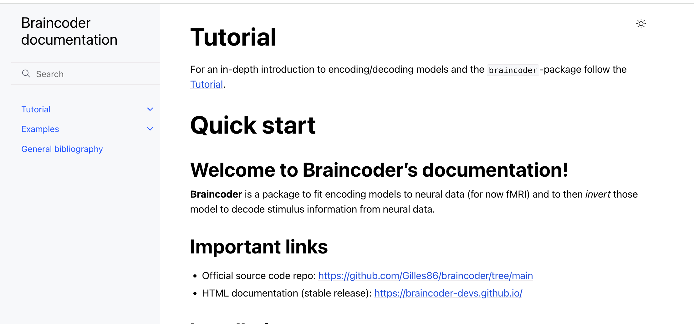
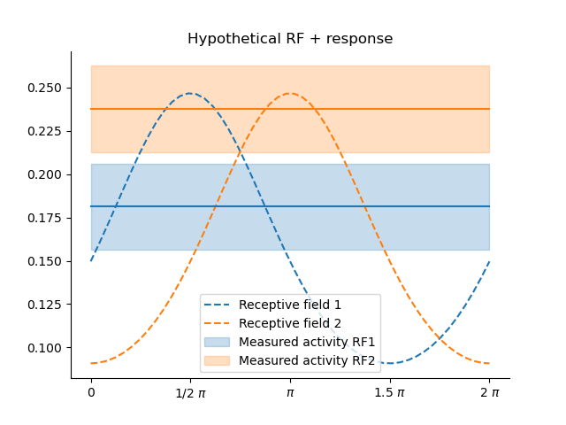
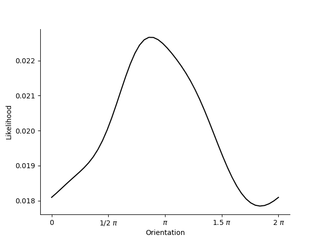

### **braincoder**: (Encoding &) Decoding Neural Data

<div class="center">



</div>

**Gilles de Hollander**

---

### **braincoder**

<div class="text-mediumsmall">

 * Developed at **University of Amsterdam**, **Spinoza Centre for Neuroimaging** and **UZH**
 * **Maintainer** 
   - Gilles de Hollander
 - **Contributors** 
   - Tomas Knapen (UvA/Spinoza Centre for Neuroimaging)
   - Marco Aqil (UvA/Spinoza Centre for Neuroimaging)
   - Maike Renkert (UZH)
 - Upcoming paper
 - Extensive documentation: <a href="https://braincoder-devs.github.io/">braincoder-devs.github.io</a>

 </div>

---

### **braincoder**

 **Key features:**

  * Massive computationa optimisation thanks to Tensorflow and GPUs
  * Ease-of-use
  * All standard models implemented
  * **Inversion of encoding models**


---
#### **1. Encoding Models: Mapping Stimulus → BOLD**

<div class="two-col">

<div class="col text-medium">

**Deterministic mapping**: $f(s; \theta): s \mapsto y$

  - $s$: Stimulus (e.g., orientation, numerosity, 2D image)
  - $y$: BOLD response (single voxel $y$ or pattern $Y$)
  - $\theta$: Parameters (e.g., PRF center/dispersion, amplitude, baseline)


</div>

<div class="col text-medium center">

**Example: 1D Gaussian PRF**
$$
f(s; \boldsymbol{\mu}, \sigma, a, b) = a \cdot \mathcal{N}(s; \boldsymbol{\mu}, \sigma) + b
$$


</div>
</div>

---
#### **2. Linear Encoding Models**
<div class="text-small">
<div class="two-col">
<div class="col">

- **"Jehee approach"**
- **Fixed neural populations (fixed $\theta$)** + **linear weights**:
  $$
  x_j = \sum_i W_{i,j} \cdot f_j(\theta_j)
  $$
- **Advantage**: Fit weights \( W \) with **linear regression** (fast! Can be done with standard fMRI analyses packages.).
- **Disadvantages**: 
  - Parameters are not interpretable
  - Model mispecification?
- **Example**: Von Mises tuning curves for orientation.

</div>


<div class="col center">

**Basis Functions**


**Voxel Predictions**


</div>

</div>


</div>
</div>
</div>


---
#### **3. Building the Likelihood**

- **Add Gaussian noise** to deterministic models:
  $$
  p(x|s; \theta) = f(s; \theta) + \epsilon, \quad \epsilon \sim \mathcal{N}(0, \Sigma)
  $$

- **Covariance matrix ($\Sigma$)**:
  - Regularized estimate (shrinkage + neural population overlap).
  - Accounts for voxel-to-voxel noise correlations.

**Key**:
- Enables **Bayesian inversion** (stimulus decoding).

---
#### **4. From Neural Responses → Stimulus Features**

<div class="two-col">

<div class="col">

**Bayes’ Rule**:
$$
p(s|x, \theta) = \frac{p(x|s, \theta) p(s)}{p(x)}
$$

**Approach**:
- Keep $\theta$ and $s$ fixed, and evalute/estimate/sample over $s$.

</div>

<div class="col center">



</div>
</div>

---
#### **4. From Neural Responses → Stimulus Features**

<div class="two-col">

<div class="col">

**Bayes’ Rule**:
$$
p(s|x, \theta) = \frac{p(x|s, \theta) p(s)}{p(x)}
$$

**Approach**:
- Keep $\theta$ and $s$ fixed, and evalute/estimate/sample over $s$.

</div>

<div class="col center">



</div>
</div>

---
## **5. Decoding Noisy Neural Data**

<div class="text-medium">

**Steps**:
1. Fit encoding model ($\theta$) (grid + gradient descent).
2. Estimate noise covariance ($\Sigma$).
3. Compute **posterior** ($p(s|x;\theta)$).
4. Extract **mean posterior** or **MAP estimate**.
5. (Extract **uncertainy** surrounding posterior)

</div>

---
## **Key Takeaways**

- **Encoding**: Map stimuli to BOLD (linear/non-linear models).
- **Decoding**: Invert models using Bayesian inference + noise modeling.
- **Tools**:
  - `braincoder` can do all of this and leverages **TensorFlow** for fast, GPU-accelerated fitting.

**Your Turn**:
- Try fitting a PRF model to your own data!

---
### Example code for PRF fit

<div class='text-twenty'>

```python
from braincoder.models import GaussianPRF2DWithHRF
from braincoder.hrf import SPMHRFModel
from braincoder.optimize import ParameterFitter

# Set up model, including HRF
hrf_model = SPMHRFModel(tr=1.7)
model = GaussianPRF2DWithHRF(grid_coordinates=grid_coordinates, hrf_model=hrf_model)

# Set up fitter
fitter = ParameterFitter(data=v1_ts, model=model, paradigm=stimulus)

# Define grid search parameters
mu_x = np.linspace(-3, 3, 20, dtype=np.float32)
mu_y = np.linspace(-3, 3, 20, dtype=np.float32)
sigma = np.linspace(0.1, 5, 20, dtype=np.float32)
baselines = [0.0]
amplitudes = [1.0]

# Do grid search using correlation cost (so baseline and amplitude do not matter)
grid_pars = fitter.fit_grid(mu_x, mu_y, sigma, baselines, amplitudes, use_correlation_cost=True)

 # Refine baseline and amplitude using OLS
grid_pars = fitter.refine_baseline_and_amplitude(grid_pars)
gd_pars = fitter.fit(init_pars=grid_pars)
```

</div>

---
### Assigment 4: Decoding visual stimuli

Open `notebooks/4_decode.ipynb`.