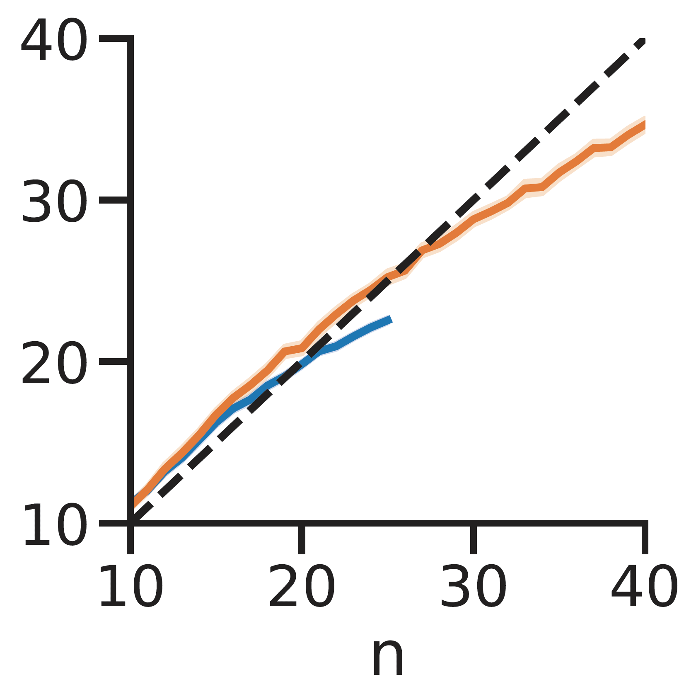

### Efficient coding, efficiently coded

**Gilles de Hollander**

---
### Efficient Coding: Key Ideas

**1. Sensory Space Representation**
- Stimulus features encoded in sensory space
- Noise is **homoscedastic** (constant variance)
- Encoding function:
  e,g., $f(x) = x^\alpha$ ($\alpha < 1$)
- Neurocognitive representation $r$:
  $$r|x_0 \sim \mathcal{N}(f(x_0), \nu^2)$$

---
### Efficient coding: Key ideas 
**2. Bayesian Inference**
- Estimate stimulus value $\hat{x}$ using Bayesian inference:
- Posterior distribution:
  $$p(x|r) = \frac{p(r|x)p(x)}{p(r)}$$
 - Posterior mean is least-square estimator
  $$\hat{x} = \mathbb{E}[x|r] = \int x \, p(x|r) \, dx$$

---
#### Why computational graphs?

 * For model fitting we want to estimate parameters.
 * Often we can not derive likelihood functions, but we can *evaluate* them for specific values.
   * Approximate integrals using grids (GPU!) 
   * MCMC sampling
 * Both often involve the same calculation on a very large number of variables.

---
#### Implementation Steps

**1. Define the Generative Model**
- **Encoding function:** $f(x) = x^\alpha$
- **Noise model:** $r \sim \mathcal{N}(f(x_0), \nu^2)$

**2. Build the Likelihood Grid**
- Create a grid of possible $x_0$ and $r$ values
- Make a $p(r | x_0)$ for each pair

**3. Bayesian Inference**
- For each observed $r$, compute the posterior:
  $$p(x|r) = \frac{p(r|x)p(x)}{p(r)}$$
- Estimate $\hat{x}$ as the expected value:
  $$\hat{x} = \mathbb{E}[x|r]$$

**4. Data Likelihood Function**
- Define a function that returns the response distribution over $\hat{x}$ for any $x_0$: $p(\hat{x} | x_0)$.

---
### Approach
Approximate (bounded) distributions using large arrays (vectorize, vectorize, vectorize).

---
### Assignment 5: Efficient coding
 - We wil now go over some code together in `notebooks/5_efficient_coding.ipynb`

